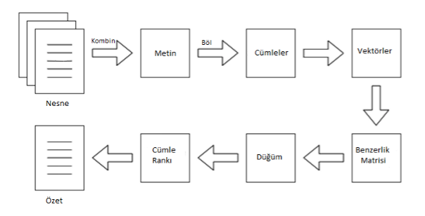

## Textrank with Zemberek

Anahtar kelimeler, veriler ile kullanıcının aradıkları içerik arasındaki bağlantıyı
kurmaktadır. Bu araştırmamızda anahtar kelimeleri bulma algoritmalarından biri
olan textrank algoritmasını kullandık. Textrank algoritmasını kullanırken
Zemberek kütüphanesinden faydalanarak Türkçe metinler üzerinde çalışmalar
yaptık.

#### Textrank Çalışma Prensibi ->



## Installation

Zemberek framework üzerinde işlem yapabilmek için Python-Java arasında iletişimi sağlayacak gRPC protokolu etkinleştirilir.

```bash
java -jar zemberek-full.jar StartGrpcServer --dataRoot data/
```

Poetry sisteme tanımlanır ve gerekli bağımlılıklar kurulur.

```bash
poetry init 
poetry run python3 main.py
```

```

├── data
│   ├── classification
│   │   ├── news-title-category-set
│   │   ├── news-title-category-set.lemmas
│   │   └── news-title-category-set.tokenized
│   ├── lm
│   │   └── lm.2gram.slm
│   ├── misc
│   │   └── Bad Dictionary Items Work.docx
│   └── normalization
│       ├── ascii-map
│       ├── lookup-from-graph
│       └── split
├── doc
├── summarizer
│   ├── core
│   │   ├── grpc_server.py
│   │   ├── __init__.py
│   │   ├── rank_calc.py
│   │   ├── text_rank.py
│   │   └── turkish_nlp.py
│   ├── main.py
│   └── utils
│       ├── __init__.py
│       ├── language_id_pb2_grpc.py
│       ├── language_id_pb2.py
│       ├── morphology_pb2_grpc.py
│       ├── morphology_pb2.py
│       ├── normalization_pb2_grpc.py
│       ├── normalization_pb2.py
│       ├── preprocess_pb2_grpc.py
│       ├── preprocess_pb2.py
│       ├── proto_gen.sh
|
├── poetry.lock
├── pom.xml
├── pyproject.toml
├── README.md
└── zemberek-full.jar
```
